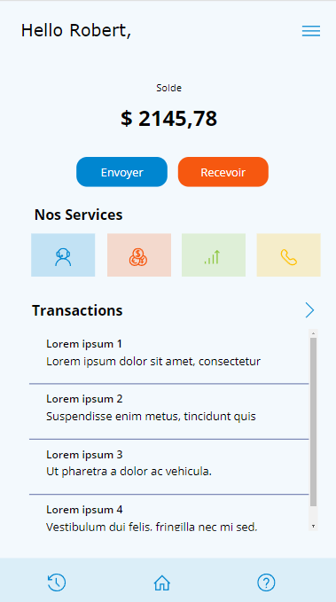

# PowerApps Styling Automation

Automate the styling of your PowerApps applications with ease using our Python script. This tool allows you to retrieve the JSON files of your applications and modify them to apply a personalized style.

## Installation

To install this tool, simply clone this repository and install the required Python packages:

$ git clone https://github.com/JosueAbou/Mise_en_style_application_powerapps.git 

There are no requirements needed to make it work, you just need to have python installed.

## Usage

To use this tool, you'll need to follow these steps:

1. Specify the naming conventions for the styles you want to apply. For example, if you want to apply a style to a button, you might name it `primary_button`.
2. Develop your PowerApps application, using the naming conventions you've specified.
3. Run the Python script to apply your custom styles to the application.

Here's an example of how to use the script:

$ python powerapps_style.py --app <app_name> --style <style_file>

Where `<app_name>` is the name of your PowerApps application, and `<style_file>` is the path to the JSON file that defines your custom styles.

## Example
Solarized dark             |  Solarized Ocean
:-------------------------:|:-------------------------:
  |  

 

## Contributing

We welcome contributions from the community! To contribute to this project, simply fork this repository, make your changes, and submit a pull request.

## License

This project has no license

## Contact

If you have any questions or issues with this tool, please contact us at <sopra@gmail.com>. We're happy to help!
