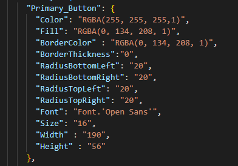

# PowerApps Styling Automation

Automate the styling of your PowerApps applications with ease using our Python script. This tool allows you to retrieve the JSON files of your applications and modify them to apply a personalized style.

## Installation

To install this tool, simply clone this repository and install the required Python packages:

$ git clone https://github.com/JosueAbou/Mise_en_style_application_powerapps.git 

There are no requirements needed to make it work, you just need to have python installed.

## Usage

To use this tool, you'll need to follow these steps:

### 1. Definition of Style
In order to use this tool, we must define beforehand the style that we would like to apply to the different components of our application. This style must be defined in a JSON file with a very specific format. Just group a set of attributes with specific values and then give them a name. This name must then be used during the development of the application in order to be able to apply the predefined style to it later. For example, here are the characteristics defined for a `"Primary_button"`:

All the buttons of the application with this name will therefore have this style applied after execution of our script. 

For the example (just below), the style we defined is in the `/script/style.json` file.

### 2. Development of the Application Respecting the Naming Rules
As explained above, the controls of the PowerApps application must be named correctly in order to be able to apply the style to them. Any control that does not respect the naming rule will not be modified. Once the application has been developed, it must be exported in .msapp format.

### 3. Running the Script
You must first extract from the controls directory, the file corresponding to the page you want to modify, then execute the following command:

$ python powerapps_style.py --app_file <app_file> --style_file <style_file>

Where `<app_file>` is the name of the file extracted from your PowerApps application, and `<style_file>` is the path to the JSON file that defines your custom styles.

## Example
App without Style          |  App after applying the style with our script 
:-------------------------:|:-------------------------:
  |  

## Contributing

We welcome contributions from the community! To contribute to this project, simply fork this repository, make your changes, and submit a pull request.

## License

This project has no license

## Contact

If you have any questions or issues with this tool, please contact us at <sopra@gmail.com>. We're happy to help!
